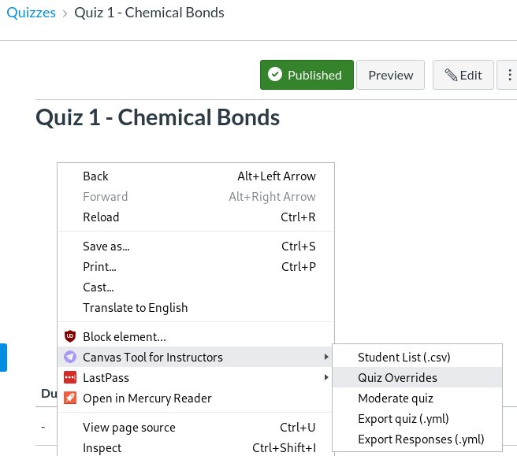
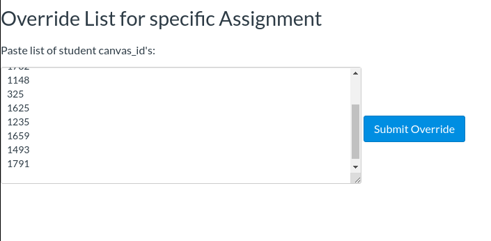

ChromeExtension for CanvasLMS
==============================

Installing
--------------------
Available free at the [Chrome WebStore](https://chrome.google.com/webstore/detail/canvas-utility-belt/eihecihickbkcionkdabocomlbopidpk)

Usage
---------------------------------

This tool adds features to Canvas LMS that allow you to
perform certain tasks for Quizzes in bulk in order to save time. Current
features include assigning a quiz to only be available to specific
students or to be available to certain students at different times (Quiz
Overrides) and giving extra time and/or extra attempts on a quiz to
specific students (Moderate Quiz).

To use this tool, you will need to use students’ canvas
IDs which are different from their student IDs . So the first step
before using Quiz Overrides or Moderate Quiz is to download a .csv file
containing all the students in the current course. You can open this
file in *Excel* or any other program that can open a .csv file.

Steps to download canvas ID:

1.  Enter your course in Canvas
2.  Right-click anywhere on the webpage (note: this can
    be done from anywhere in your course, you do not need to be on a
    specific page).
3.  In the menu that appears, click ‘Student List
    (.csv)’:

4.  You will see the following pop-up window. Click ‘ok’:

5.  Wait a few seconds.
> (Note: Large class-sizes take longer to download, you may need to wait 10-20 seconds)
6.  When the file is ready to be saved, another window
    will appear. You can select the location where you want to save the
    file and edit the file name. When you are done, click **‘Save’**.
7.  Now that you have saved the file, you can navigate
    to that location on your computer and open it in Excel or any other
    program that can open a .csv file.
8.  In the file, you will see three columns:
    `canvas_id`, `sis_id`, and `name`.
    * `canvas_id` is the id that canvas uses internally. Use this id to specify which students you want to apply to **Quiz Overrrides** or **Moderate Quiz**.
    * `sis_id` corresponds to the student ID that you institution communicates to Canvas.
       Use this, along with `name` to lookup the canvas_id for your students.
    * Below is an example of what the file will look like:

            

### Quiz Overrides

This feature lets you specify whether/when a specific
group of students can access a quiz. Instead of selecting students
individually and potentially making errors, you can more easily do it in
bulk using this tool.

Steps:

1.  Go to the Quizzes page and click on a specific
    quiz.
2.  Right-click anywhere on the quiz page.
3.  Under *“Canvas Tool …”* select “*Quiz Overrides”*.

4.  The form below will appear. Paste the list of students' canvas\_id into the
    textbox. 
5.  Click “*Submit Override*”.
6.  A green box will alert you to a successful submission.
7.  The page will automatically reload in 5 seconds.
    Now check that the submitted students show up on the quiz
    page.

### Moderate Quiz

Some students need special accommodations in the form
of extra time or extra attempts. This list of students typically will
not change throughout the semester and will need to be applied for every
quiz. With this tool, you can just make that list of students’
canvas\_ids once and save it on your computer to reuse throughout the
semester.

Steps:

1.  Go to the Quizzes page and click on a specific
    quiz.
2.  Right-click anywhere on the quiz page.
3.  Under *“Tool for Canvas LMS”* select *“Moderate quiz”*. 
4.  The form below will appear. Paste the list of
    students' canvas\_ids into the textbox.
5.  Set the accommodations required. (For example, in
    the screenshot, I set 123 extra minutes for 11 students.)
6.  Click “*Submit Quiz Extensions*”.
7.  A green box will alert you to a successful
    submission:
8.  The page will automatically reload in 5 seconds.
    Now check that the submitted students have the requested
    accommodations on the moderate page:

### Quiz Export/Import

#### Question Format
Questions are defined using YAML. [Find out more about how to format the questions](docs/yaml/format.md)

#### Usage

TODO

## Development

| Command       | Task                                                                          |
| ------------- | ---------------------------------------------------                           |
| `yarn build`  | Bundle the code into `dist/`. This folder can be directly loaded into Chrome. |
| `yarn lint`   | Fix source-code styling errors.                                               |
| `yarn test`   | Run the unit tests via Mocha.                                                 |
